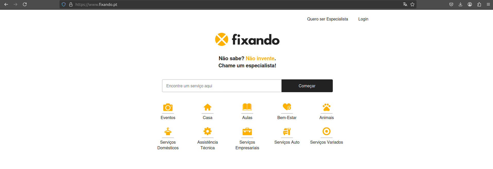

# Competitor Analysis: Fixando
## General Information 

# Competitor Analysis: StarOfService
## General Information 

- **Name of System:** Fixando
- **Company/Developer:**  Fixando B.V.
- **Website/Product Page:**  https://www.fixando.pt/
- **Version/Release Date:** Fundada em 2017
- **Platform(s) Supported:** Web, Aplicações Móveis (iOS e Android)
- **Target Audience:** Indivíduos e empresas que procuram contratar ou oferecer serviços em diversas categorias, como serviços para a casa, eventos, bem-estar, entre outros

---
## Core Functionality 

**Primary Purpose:**  A Fixando é uma plataforma online que conecta clientes a profissionais especializados em mais de 1.200 categorias de serviços, facilitando a contratação de especialistas para diversas necessidades.

**Key Features:**
- **Diversidade de Serviços:** Oferece uma ampla gama de categorias, incluindo serviços para a casa, eventos, animais, assistência técnica e outros.
- **Sistema de Avaliações:** Profissionais avaliados pelos clientes.
- **Operação Internacional:** Presença em vários países além de Portugal, como Alemanha, Áustria, Suíça, Espanha, ….

**Unique Selling Points (USPs):**
- **Reconhecimento de Qualidade:** Vencedora dos Prémios 5 Estrelas de Melhor Plataforma Online de Contratação de Serviços por cinco anos consecutivos (2018 a 2022).
- **Facilidade de Uso:** Processo simples onde o cliente descreve a necessidade, recebe propostas de profissionais e escolhe a que melhor se adapta, tudo através da plataforma.
- **Segurança e Confiança:** Profissionais verificados e avaliações detalhadas ajudam a garantir a qualidade dos serviços prestados.

**Limitations/Weaknesses:**
- **Dependência de Terceiros:** A qualidade do serviço final depende dos profissionais cadastrados, podendo haver variação na satisfação dos clientes.
- **Concorrência de Mercado:** Presença de concorrentes fortes no mercado português, como Zaask e StarOfService, oferecendo serviços similares.

---
## Screenshots

## Online Reviews

- **App Store:** Classificação de 4,3/5 baseada em 96 avaliações.
  - *Comentário de utilizador:* "Me ajudou muito a encontrar um fotógrafo!" – dbedeschi
- **Google Play Store:** Classificação de 4,1/5 baseada em 1136 avaliações.

