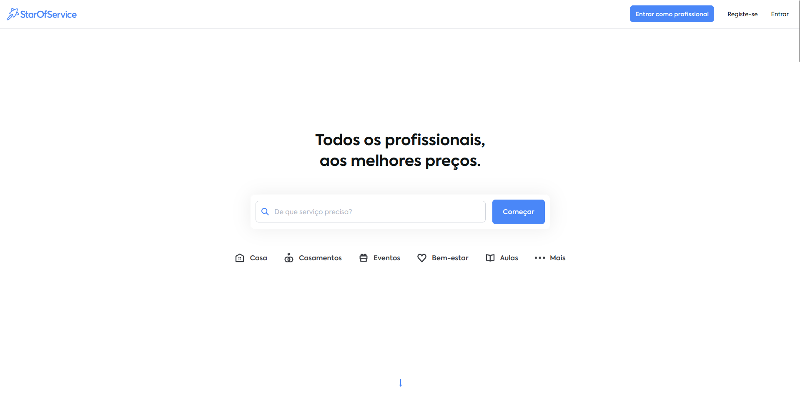

# Competitor Analysis: StarOfService
## General Information 

- **Name of System:** StarOfService
- **Company/Developer:** StarOfService SAS
- **Website/Product Page:**  https://www.starofservice.pt/
- **Version/Release Date:** Fundada em 2012
- **Platform(s) Supported:** Web
- **Target Audience:** Indivíduos e empresas que procuram contratar ou oferecer serviços profissionais em diversas áreas, como jardinagem, pintura de casas, entre outros.

---
## Core Functionality 

**Primary Purpose:** StarOfService é uma plataforma online que conecta profissionais a clientes que procuram serviços específicos, facilitando a contratação de especialistas em várias áreas.

**Key Features:**
- **Diversidade de Serviços:** Oferece uma ampla gama de categorias de serviços, permitindo que os clientes encontrem profissionais para quase todas as necessidades.
- **Sistema de Correspondência:** Utiliza um sistema que combina pedidos de clientes com ofertas de profissionais baseados na localização e especialização.
- **Expansão Global:** Presente em 78 países, abrangendo 5 continentes e oferecendo serviços em 32 idiomas.

**Unique Selling Points (USPs):**
- **Alcance Internacional:** A presença em múltiplos países permite uma vasta rede de profissionais e clientes.
- **Variedade de Serviços:** Mais de 900 categorias de serviços disponíveis, atendendo a uma ampla gama de necessidades dos clientes.
- **Facilidade de Uso:** Processo simplificado onde os clientes descrevem o serviço necessário e recebem propostas de profissionais interessados.

**Limitations/Weaknesses:**
- **Qualidade Variável dos Serviços:** A experiência do cliente pode variar dependendo do profissional contratado, e a plataforma depende das avaliações para manter a qualidade.
- **Suporte ao Cliente:** Alguns utilizadores relataram dificuldades em obter suporte eficiente quando enfrentam problemas. 

---

## Screenshots

## Online Reviews

- **Sitejabber:** Alguns utilizadores relataram experiências negativas, especialmente relacionadas ao suporte ao cliente e dificuldades em cancelar serviços. 

