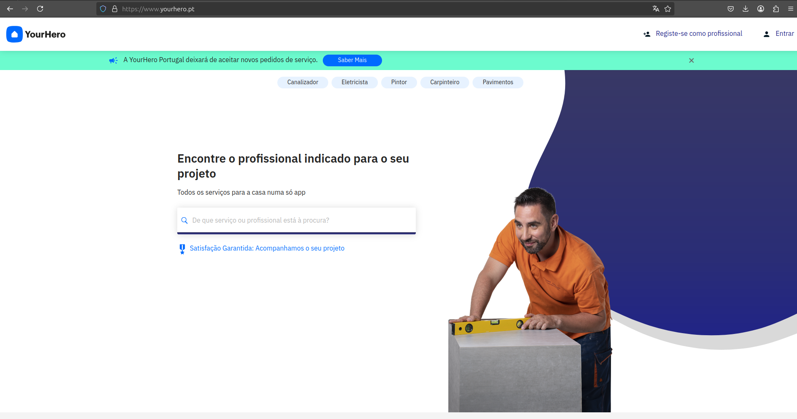

# Competitor Analysis: YourHero
## General Information 
- **Name of System:** YourHero
- **Company/Developer:** YourHero Portugal, Lda. 
- **Website/Product Page:** https://www.yourhero.com/
- **Version/Release Date:** Fundado em 2021
- **Platform(s) Supported:** Web, Aplicativos Móveis (iOS/Android)
- **Target Audience:** Proprietários de residências e empresas que necessitam de serviços domésticos e de manutenção; profissionais que oferecem esses serviços.

--- 
## Core Functionality 

**Primary Purpose:** YourHero conecta clientes a profissionais qualificados para a prestação de serviços domésticos e de manutenção de forma eficiente e confiável. A plataforma facilita a contratação de diversos serviços, garantindo que os prestadores de serviços sejam selecionados de acordo com critérios rigorosos e avaliações positivas de clientes anteriores.

**Key Features:** 
- **Diversidade de Serviços:** Oferece uma ampla gama de serviços, como limpeza, canalização, jardinagem, eletricidade, carpintaria, entre outros.
- **Seleção de Profissionais:** Avaliados: Profissionais são escolhidos com base em suas qualificações e avaliações de clientes anteriores, garantindo confiança e qualidade.
- **Acompanhamento de Projetos:** Permite que clientes acompanhem o progresso de seus projetos em tempo real e tenham garantias quanto à conclusão satisfatória. 

**Unique Selling Points (USPs):** 
-**Processo de Seleção Rigoroso:** Todos os profissionais passam por um processo de seleção e treinamentos, garantindo serviços de alta qualidade.
-**Foco no Desenvolvimento Profissional:** Oferece ferramentas e métricas para que os prestadores de serviços possam melhorar suas habilidades e expandir seus negócios.
-**Suporte ao Cliente 24/7:** Disponibilidade de atendimento ao cliente a qualquer momento, proporcionando assistência contínua durante todo o processo de contratação e execução de serviços.

**Limitations/Weaknesses:**
-**Feedback Negativo de Clientes:** Alguns clientes relataram experiências insatisfatórias, principalmente relacionadas à falta de responsabilidade de profissionais ou da plataforma.
-**Descontinuação de Novos Pedidos:** A empresa anunciou que deixará de aceitar novos pedidos de serviço, o que pode reduzir a disponibilidade para novos clientes ou limitar o crescimento da base de usuários.

---

## Screenshots

## Online Reviews

- **App Store:** 4,5/5 baseada em 2 avaliações.
- **Google Play Store:** 3,8/5 baseada em 102 avaliações.