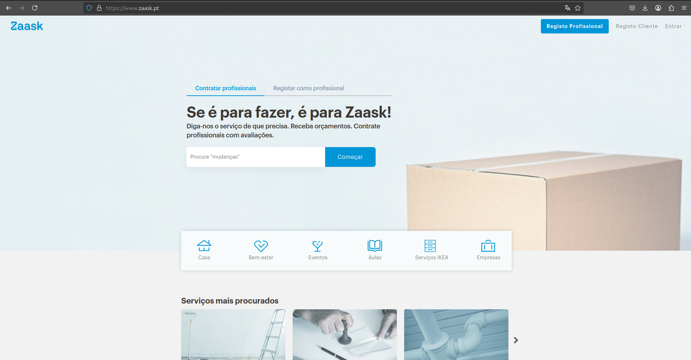

# Competitor Analysis: Zaask 
## General Information 

- **Name of System:** Zaask
- **Company/Developer:** Zaask - Plataforma Digital, S.A.
- **Website/Product Page:** https://www.zaask.pt/
- **Version/Release Date:** Fundada em 2012
- **Platform(s) Supported:** Web
- **Target Audience:** Indivíduos e empresas em Portugal e Espanha que procuram contratar ou oferecer serviços profissionais em diversas áreas, como bem-estar, eventos, aulas, entre outros.

--- 
## Core Functionality 

**Primary Purpose:** Zaask é uma plataforma online que conecta clientes a profissionais locais para a realização de diversos serviços, facilitando a contratação e gestão de projetos pessoais e empresariais.

**Key Features:**
- **Diversidade de Serviços:** Oferece uma ampla gama de categorias, incluindo serviços para casa, bem-estar, eventos, aulas e empresas. 
- **Sistema de Avaliações:** Profissionais avaliados pelos clientes, proporcionando confiança e transparência na escolha do prestador de serviço.
- **Expansão Regional:** Operação em todas as cidades de Portugal e presença também na Espanha. 

**Unique Selling Points (USPs):** 
- **Foco no Mercado Ibérico:** Especialização nos mercados de Portugal e Espanha, entendendo as necessidades específicas destes públicos.
- **Parceria com a Worten:** Aquisição pela Worten em 2021, fortalecendo a posição no setor de serviços. 
- **Facilidade de Uso:** Processo simples onde o cliente descreve a necessidade, recebe orçamentos e escolhe o profissional adequado.

**Limitations/Weaknesses:**
- **Qualidade Variável dos Serviços:** A satisfação do cliente pode depender da competência do profissional contratado, podendo haver variações na qualidade dos serviços prestados.
- **Concorrência de Mercado:** Presença de outras plataformas similares no mercado pode dividir a base de usuários e profissionais.

---

## Screenshots

## Online Reviews

- **Site Oficial:** A Zaask apresenta uma média de avaliações de 4,7/5, indicando um alto nível de satisfação entre os clientes.

